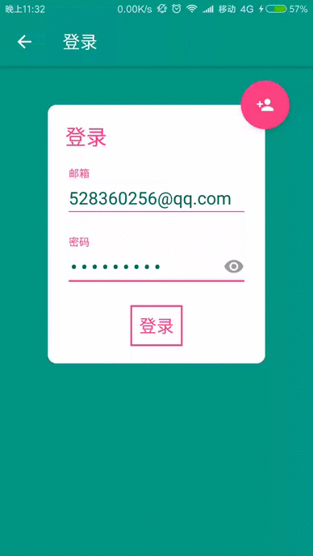
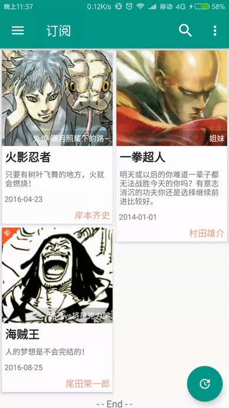

# 鼠绘漫画非官方客户端

### 一个非官方的鼠绘漫画，是一个练手的小项目，但力求涵盖android开发的各个方面，包括Retrofit请求数据，谷歌Gson,Okhttp自定义Interceptor,错误处理，视图的状态切换，Fragment平缓切换及缓存，不依赖第三方实现简单的加载更多，webview实现NestedScroll，简单的mvp模式，集成友盟统计和Fir.im版本更新等等，总之是一个适合新手参考的案例。

### 截图：

 
