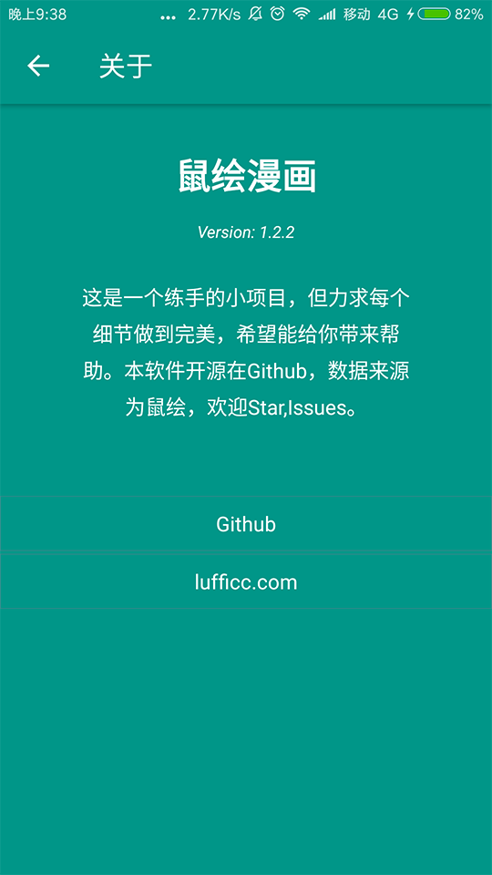
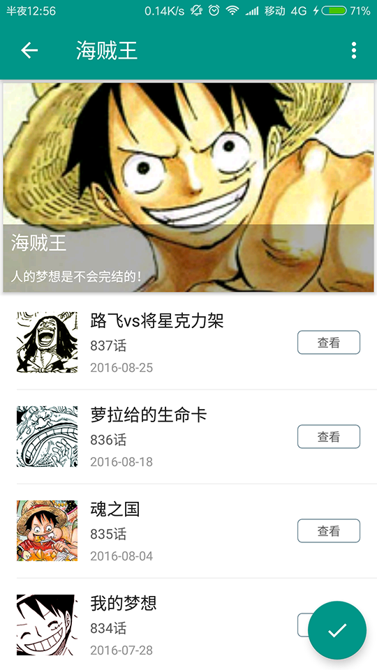

# 鼠绘漫画非官方客户端

一个非官方的鼠绘漫画，是一个练手的小项目，但涵盖android开发的各个方面，包括Retrofit请求数据，谷歌Gson,Okhttp自定义Interceptor,错误处理，视图的状态切换，Fragment平缓切换及缓存，不依赖第三方实现简单的加载更多，webview实现NestedScroll，简单的mvp模式，集成友盟统计和Fir.im版本更新等等，总之是一个适合新手参考的案例。

另外，本项目用到了自己的另一个多管理状态的layout,欢迎参考源码[lufficc/StateLayout](https://github.com/lufficc/StateLayout)

下载apk体验:[Click me](http://fir.im/ishuhui)

#### 依赖（不包括Google Support）

1.    [glide](https://github.com/bumptech/glide)
1.    [Retrofit](https://github.com/square/retrofit)
1.    [Gson](https://github.com/google/gson)
1.    [butterknife:8.2.1](https://github.com/JakeWharton/butterknife)
1.    [material-login](https://github.com/shem8/MaterialLogin)
1.    [materialsearchview](https://github.com/MiguelCatalan/MaterialSearchView)
1.    [stateLayout](https://github.com/lufficc/StateLayout)

### 截图：

### 有好的意见或者建议欢迎Issues,我的网站 [https://lufficc.com](https://lufficc.com)

# License
	Copyright 2016 lufficc

	Licensed under the Apache License, Version 2.0 (the "License");
	you may not use this file except in compliance with the License.
	You may obtain a copy of the License at

		http://www.apache.org/licenses/LICENSE-2.0

	Unless required by applicable law or agreed to in writing, software
	distributed under the License is distributed on an "AS IS" BASIS,
	WITHOUT WARRANTIES OR CONDITIONS OF ANY KIND, either express or implied.
	See the License for the specific language governing permissions and
	limitations under the License.